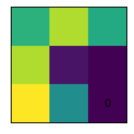

# Lipstick 💄

Lipstick is a simple, lightweight set of tools for creating beautiful visualizations.
Just apply some lipstick to your data and you're ready to go!

## Installation

Install the latest version of Lipstick with `pip`:

```bash
pip install lipstick
```

or install the latest development version from GitHub:

```bash
pip install git+git://github.com/mohammadbashiri/lipstick.git
```

## Usage

### Creating a gif

Creating animated gifs is easy with Lipstick.

```python

``` python
import numpy as np
import matplotlib.pyplot as plt
from lipstick import GifMaker

with GifMaker("sample.gif") as g:
    
    for i in range(30): # go through the frames

        # create a figure
        fig, ax = plt.subplots(figsize=(2, 2), dpi=150)
        ax.imshow(np.random.rand(3, 3))
        ax.text(2, 2, i, ha='center', va='center')
        ax.set(xticks=[], yticks=[])
        
        # add the figure object to the GifMaker
        g.add(fig)
        
g.show()
```

<p align="center">
  
</p>

### Updating the displayed figure in a loop

You have a loop and you want to update the same figure (with new results) as go through the loop? You can also use the `update_fig` method:

<p align="center">
  
</p>

## :bug: Report bugs (or request features)

In case you find a bug or would like to see some new features added to nnfabrik, please create an issue or make a PR .
